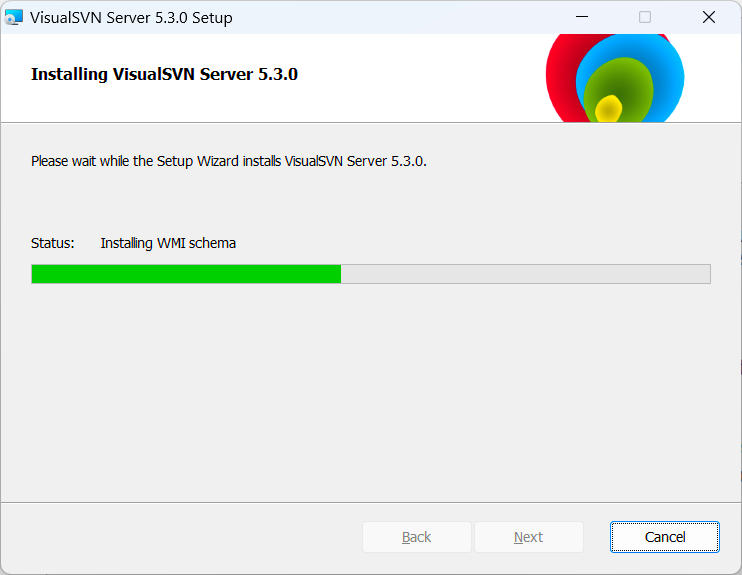

<h1 style="font-size:3.3em;color:skyblue;text-align:center">SVN学习笔记</h1>

[TOC]

---

# 概述

SVN全称SubVersion

SVN是近年来崛起的版本管理工具，是CVS的接班人。目前，绝大多数软件公司都使用SVN作为代码版本管理软件

特点：

* 操作简单，入门容易
* 支持跨平台（Window/Linux/MacOS)
* 支持版本回退功能

# 部署

SVN属于C/S结构软件

服务端软件：VisualSVN

网址：http://www.visualsvn.com/

客户端软件：TortoiseSVN

网址：http://tortoisesvn.net/downloads

https://blog.csdn.net/shangguanruier/article/details/127629878

## 服务端安装

### 第一步：下载

点击下载按钮

点击VisualSVN Server

或者直接[点击下载](https://www.visualsvn.com/files/VisualSVN-Server-5.3.0-x64.msi)

### 第二步：安装

点击接受协议

点击下一步

点击下一步

管理端

## 客户端安装

### 第一步：下载

