<h1 style="font-size:3.3em;color:skyblue;text-align:center">SVN学习笔记</h1>

[TOC]

---


# 概述

SVN全称SubVersion

SVN是近年来崛起的版本管理工具，是CVS的接班人。目前，绝大多数软件公司都使用SVN作为代码版本管理软件


特点：

* 操作简单，入门容易
* 支持跨平台（Window/Linux/MacOS)
* 支持版本回退功能


# 部署

SVN属于C/S结构软件


服务端软件：VisualSVN

网址：http://www.visualsvn.com/


客户端软件：TortoiseSVN

网址：http://tortoisesvn.net/downloads


https://blog.csdn.net/shangguanruier/article/details/127629878


## 服务端安装

### 第一步：下载


点击下载按钮


点击VisualSVN Server

或者直接[点击下载](https://www.visualsvn.com/files/VisualSVN-Server-5.3.0-x64.msi)


### 第二步：安装


点击接受协议

点击下一步


点击下一步


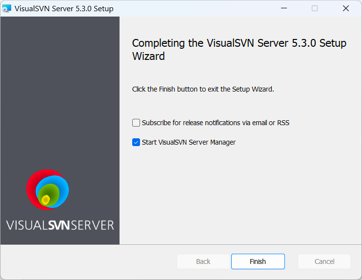


管理端


## 客户端安装

### 第一步：下载

下载链接：https://zenlayer.dl.sourceforge.net/project/tortoisesvn/1.14.5/Application/TortoiseSVN-1.14.5.29465-x64-svn-1.14.2.msi


### 第二步：安装


选择安装路径

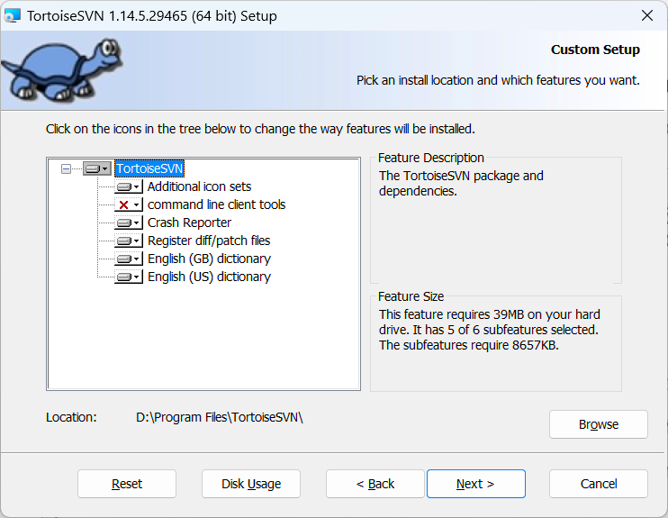


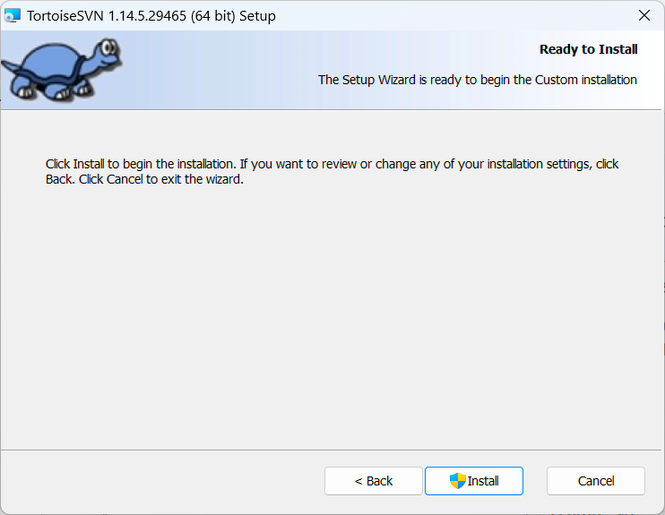


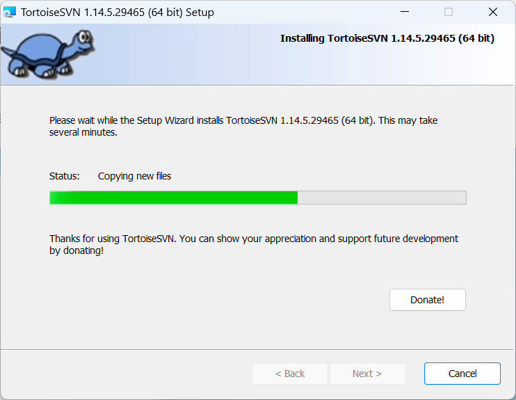


安装完成


### 第三步：安装汉化包

下载安装语言包


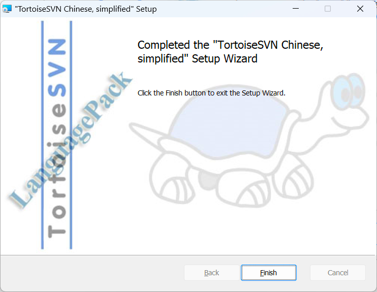


桌面右键，选择设置

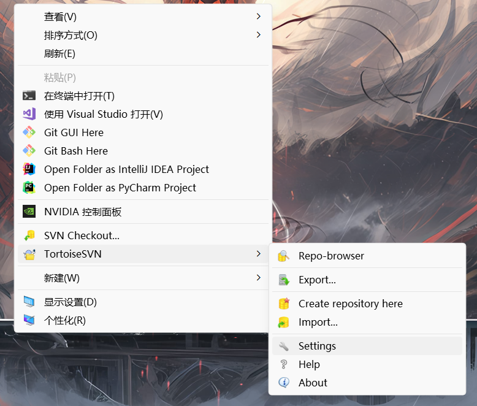


## 使用客户端软件连接SVN服务器

首先在你的项目目录鼠标右键TortoiseSVN版本库浏览器à输出SVN服务器地址


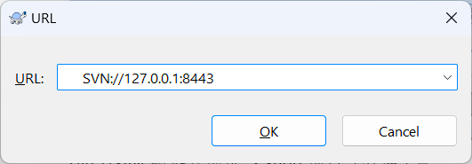


# 入门

## 配置服务端

首先在SVN服务器端创建一个公有目录WebApp做为项目目录

在WebApp目录下创建Shop文件夹，做为版本仓库

```sh
PS D:\webApp> ls


    目录: D:\webApp


Mode                 LastWriteTime         Length Name
----                 -------------         ------ ----
d-----          2023/9/7      9:25                Shop


PS D:\webApp> cd .\Shop\
PS D:\webApp\Shop> ls
PS D:\webApp\Shop>
```


创建版本仓库：

```sh
svnadmin create Shop仓库文件夹路径
```

```sh
PS D:\webApp\Shop> svnadmin create ./
PS D:\webApp\Shop> ls


    目录: D:\webApp\Shop


Mode                 LastWriteTime         Length Name
----                 -------------         ------ ----
d-----          2023/9/7      9:28                conf
d-----          2023/9/7      9:28                db
d-----          2023/9/7      9:28                hooks
d-----          2023/9/7      9:28                locks
-ar---          2023/9/7      9:28              2 format
-a----          2023/9/7      9:28            251 README.txt


PS D:\webApp\Shop> tree /f
文件夹 PATH 列表
卷序列号为 5E84-66B0
D:.
│  format
│  README.txt
│
├─conf
│      authz
│      hooks-env.tmpl
│      passwd
│      svnserve.conf
│
├─db
│  │  current
│  │  format
│  │  fs-type
│  │  fsfs.conf
│  │  min-unpacked-rev
│  │  txn-current
│  │  txn-current-lock
│  │  uuid
│  │  write-lock
│  │
│  ├─revprops
│  │  └─0
│  │          0
│  │
│  ├─revs
│  │  └─0
│  │          0
│  │
│  ├─transactions
│  └─txn-protorevs
├─hooks
│      post-commit.tmpl
│      post-lock.tmpl
│      post-revprop-change.tmpl
│      post-unlock.tmpl
│      pre-commit.tmpl
│      pre-lock.tmpl
│      pre-revprop-change.tmpl
│      pre-unlock.tmpl
│      start-commit.tmpl
│
└─locks
        db-logs.lock
        db.lock

PS D:\webApp\Shop>
```


## 服务端监管

命令：

```sh
svnserve -d  -r 版本仓库目录
```


参数：

* -d：后台运行
* -r：监管目录，版本仓库目录


光标停留在下一行就证明操作成功，此时不要关闭窗口


## 权限控制

默认情况下，SVN服务器是不允许匿名用户上传文件到服务器端的，所以必须更改系统相关配置文件

配置文件位于conf目录下的svnserve.conf文件里

文件内容如下：

```properties
### This file controls the configuration of the svnserve daemon, if you
### use it to allow access to this repository.  (If you only allow
### access through http: and/or file: URLs, then this file is
### irrelevant.)

### Visit http://subversion.apache.org/ for more information.

[general]
### The anon-access and auth-access options control access to the
### repository for unauthenticated (a.k.a. anonymous) users and
### authenticated users, respectively.
### Valid values are "write", "read", and "none".
### Setting the value to "none" prohibits both reading and writing;
### "read" allows read-only access, and "write" allows complete 
### read/write access to the repository.
### The sample settings below are the defaults and specify that anonymous
### users have read-only access to the repository, while authenticated
### users have read and write access to the repository.
# anon-access = read
# auth-access = write
### The password-db option controls the location of the password
### database file.  Unless you specify a path starting with a /,
### the file's location is relative to the directory containing
### this configuration file.
### If SASL is enabled (see below), this file will NOT be used.
### Uncomment the line below to use the default password file.
# password-db = passwd
### The authz-db option controls the location of the authorization
### rules for path-based access control.  Unless you specify a path
### starting with a /, the file's location is relative to the
### directory containing this file.  The specified path may be a
### repository relative URL (^/) or an absolute file:// URL to a text
### file in a Subversion repository.  If you don't specify an authz-db,
### no path-based access control is done.
### Uncomment the line below to use the default authorization file.
# authz-db = authz
### The groups-db option controls the location of the file with the
### group definitions and allows maintaining groups separately from the
### authorization rules.  The groups-db file is of the same format as the
### authz-db file and should contain a single [groups] section with the
### group definitions.  If the option is enabled, the authz-db file cannot
### contain a [groups] section.  Unless you specify a path starting with
### a /, the file's location is relative to the directory containing this
### file.  The specified path may be a repository relative URL (^/) or an
### absolute file:// URL to a text file in a Subversion repository.
### This option is not being used by default.
# groups-db = groups
### This option specifies the authentication realm of the repository.
### If two repositories have the same authentication realm, they should
### have the same password database, and vice versa.  The default realm
### is repository's uuid.
# realm = My First Repository
### The force-username-case option causes svnserve to case-normalize
### usernames before comparing them against the authorization rules in the
### authz-db file configured above.  Valid values are "upper" (to upper-
### case the usernames), "lower" (to lowercase the usernames), and
### "none" (to compare usernames as-is without case conversion, which
### is the default behavior).
# force-username-case = none
### The hooks-env options specifies a path to the hook script environment 
### configuration file. This option overrides the per-repository default
### and can be used to configure the hook script environment for multiple 
### repositories in a single file, if an absolute path is specified.
### Unless you specify an absolute path, the file's location is relative
### to the directory containing this file.
# hooks-env = hooks-env

[sasl]
### This option specifies whether you want to use the Cyrus SASL
### library for authentication. Default is false.
### Enabling this option requires svnserve to have been built with Cyrus
### SASL support; to check, run 'svnserve --version' and look for a line
### reading 'Cyrus SASL authentication is available.'
# use-sasl = true
### These options specify the desired strength of the security layer
### that you want SASL to provide. 0 means no encryption, 1 means
### integrity-checking only, values larger than 1 are correlated
### to the effective key length for encryption (e.g. 128 means 128-bit
### encryption). The values below are the defaults.
# min-encryption = 0
# max-encryption = 256
```


修改第19行的`anon-access = read`，取消注释，更改成`anon-access = write`


## 客户端连接SVN服务器

先Checkout检出，相当于git的克隆

创建一个自己的项目目录，进入此目录，在项目目录点击鼠标右键，选择版本库浏览器


输入SVN服务器地址

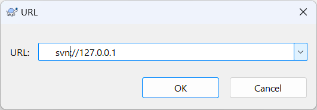


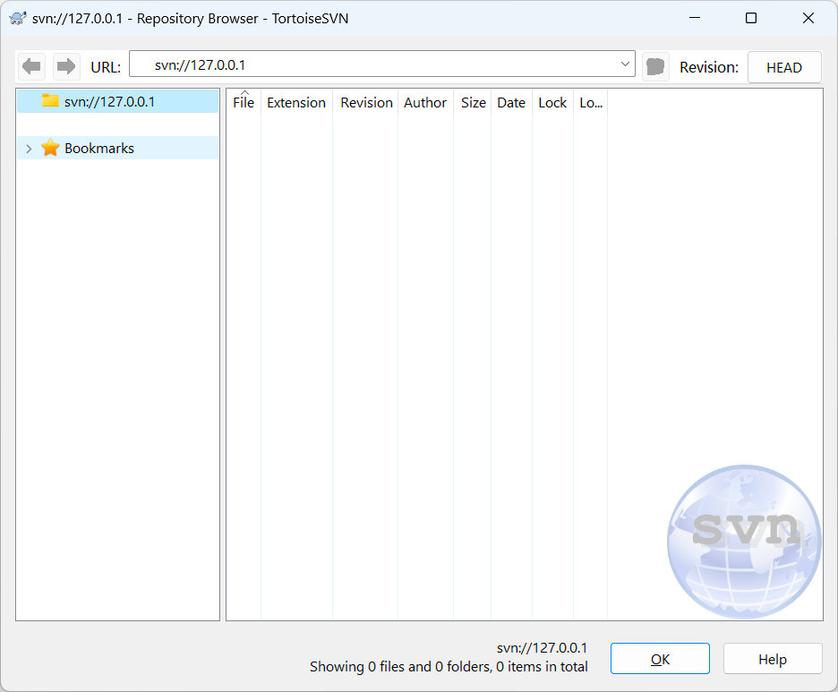


右键点击检出


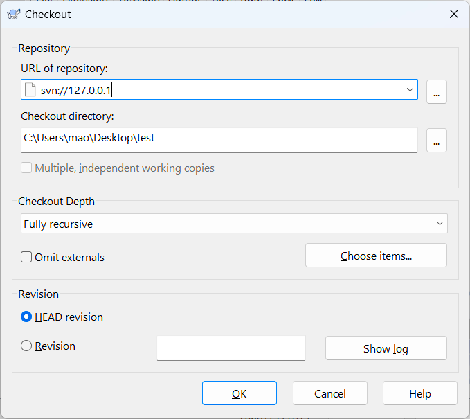


如果出现.svn文件夹，则检出成功


```sh
PS C:\Users\mao\Desktop\test\.svn> ls


    目录: C:\Users\mao\Desktop\test\.svn


Mode                 LastWriteTime         Length Name
----                 -------------         ------ ----
d-----          2023/9/7     10:00                pristine
d-----          2023/9/7     10:00                tmp
-a----          2023/9/7     10:00              3 entries
-a----          2023/9/7     10:00              3 format
-a----          2023/9/7     10:00         122880 wc.db
-a----          2023/9/7     10:00              0 wc.db-journal


PS C:\Users\mao\Desktop\test\.svn>
```


# SVN三大指令

## Checkout

检出操作，相当于git的`git clone`

Checkout只在第一次链接时操作一次，以后如果进行更新操作可以使用Update

步骤：

1. 链接到SVN服务器端
2. 更新服务端数据到本地


## Commit

提交操作，相当于git的`git commit`

提交本地数据到服务器端


先在项目目录下创建2个文件a.java和b.txt

```sh
echo "public class AiFaceApiBO {
    public AiFaceApiBO() {
    }
}
" > a.java
```

```sh
echo "123456
123456
123456" > b.txt
```


```sh
PS C:\Users\mao\Desktop\test> echo "public class AiFaceApiBO {
>>     public AiFaceApiBO() {
>>     }
>> }
>> " > a.java
PS C:\Users\mao\Desktop\test> echo "123456
>> 123456
>> 123456" > b.txt
PS C:\Users\mao\Desktop\test> ls


    目录: C:\Users\mao\Desktop\test


Mode                 LastWriteTime         Length Name
----                 -------------         ------ ----
-a----          2023/9/7     10:14            130 a.java
-a----          2023/9/7     10:14             46 b.txt


PS C:\Users\mao\Desktop\test>
```


创建完成后，在项目目录点击鼠标右键，选择svn提交

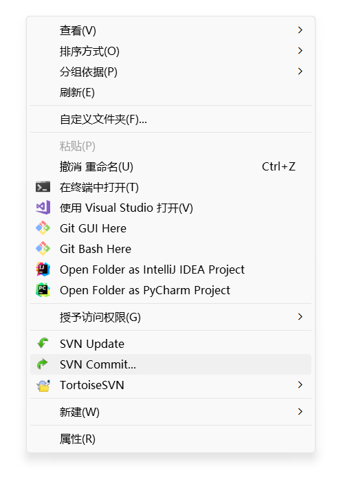


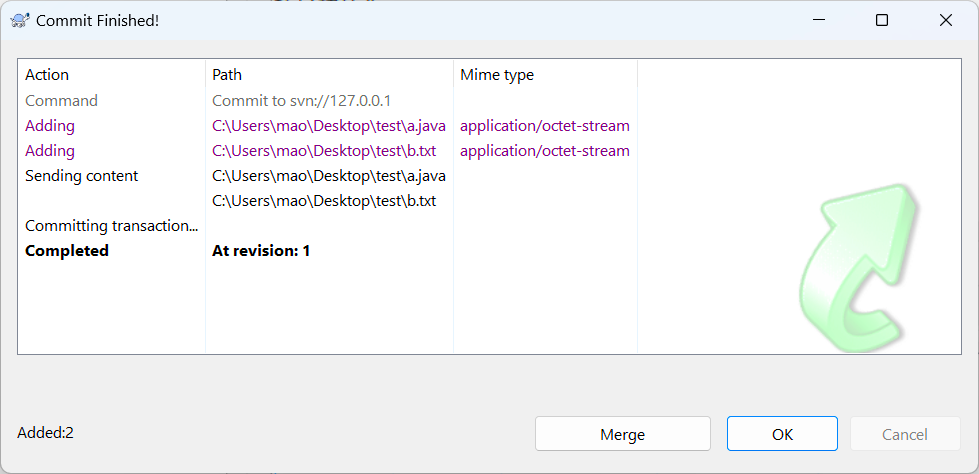


现在更改b.txt文件的内容

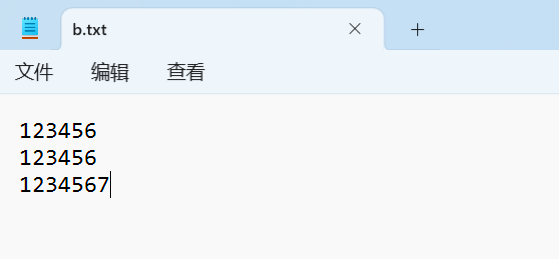

再次点击提交


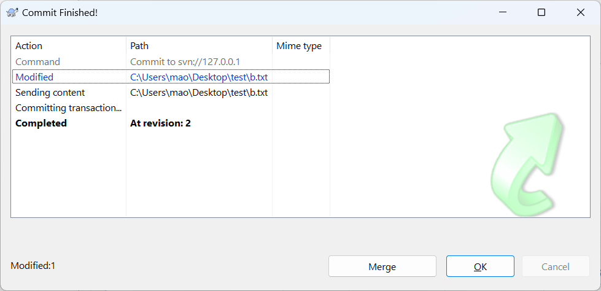


## Update

创建一个目录test2，在test2目录下使用检出功能，模拟另一个用户操作


此时test2目录下有2个文件

```sh
PS C:\Users\mao\Desktop\test2> ls


    目录: C:\Users\mao\Desktop\test2


Mode                 LastWriteTime         Length Name
----                 -------------         ------ ----
-a----          2023/9/7     10:47            130 a.java
-a----          2023/9/7     10:47             46 b.txt


PS C:\Users\mao\Desktop\test2> cat .\b.txt
123456
123456
1234567
PS C:\Users\mao\Desktop\test2>
```


更改b.txt文件的内容

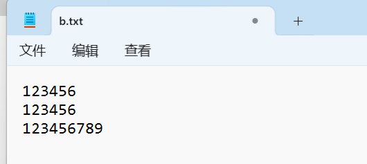


添加一个文件c.txt

```sh
echo "123" > c.txt
```


提交


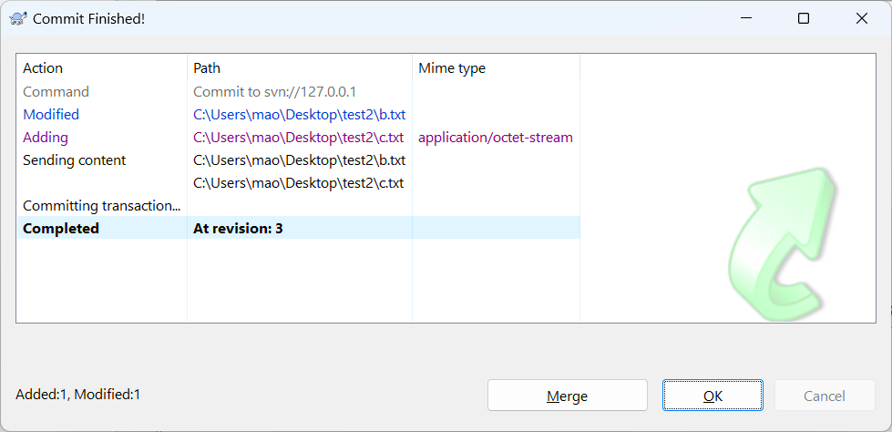


此时test2目录下的版本为3，服务器最新版本为3，但是test目录下的版本为2，test目录需要更新


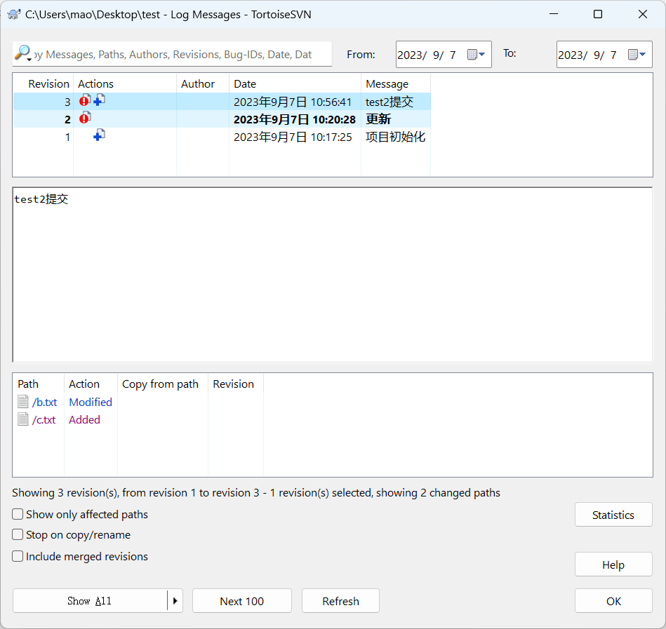


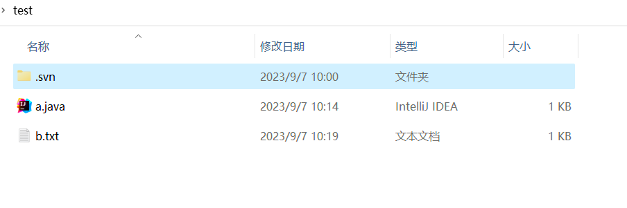


右键点击更新


```sh
PS C:\Users\mao\Desktop\test> ls


    目录: C:\Users\mao\Desktop\test


Mode                 LastWriteTime         Length Name
----                 -------------         ------ ----
-a----          2023/9/7     10:14            130 a.java
-a----          2023/9/7     11:01             50 b.txt
-a----          2023/9/7     11:01             12 c.txt


PS C:\Users\mao\Desktop\test> cat .\b.txt
123456
123456
123456789
PS C:\Users\mao\Desktop\test> cat .\c.txt
123
PS C:\Users\mao\Desktop\test>
```


# 图标集

图标一般位于日志显示


## 常规图标

当客户端文件与服务器端文件完全同步时，系统会显示图标


## 冲突图标

当客户端提交的文件与服务器端数据有冲突，系统会显示图标


## 删除图标

当服务端数据已删除，那么客户端该文件将显示图标


## 增加图标

当我们编写文档已添加到提交队列，那么系统将自动显示图标


## 无版本控制图标

当我们编写的文件没有添加到上传队列，系统将自动显示图标


## 修改图标

当客户端文件有修改但未提交，此时将自动显示图标


## 只读图标

当客户端文件以只读形式存在时，将自动显示图标


## 锁定图标

当服务端数据已锁定，那么客户端文件将自动显示图标


## 忽略图标

客户端文件已忽略，不需要进行提交上传，那么将自动显示图标


# 忽略文件

## 概述

有些文件不希望上传至svn服务器，应该将该文件或该类型的文件添加至忽略列表


## 忽略某个指定的文件

在test目录下生成一个名字为d.txt的文件

右键单击文件


选择d.txt


再次提交

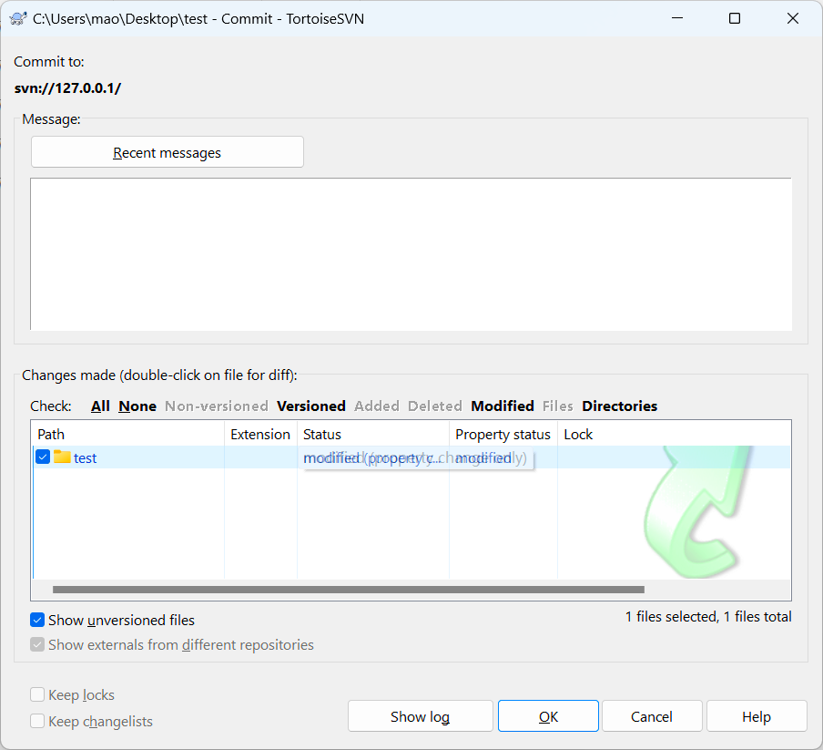


并没有看到d.txt

修改d.txt


再次点击提交，并没有看到任何更改

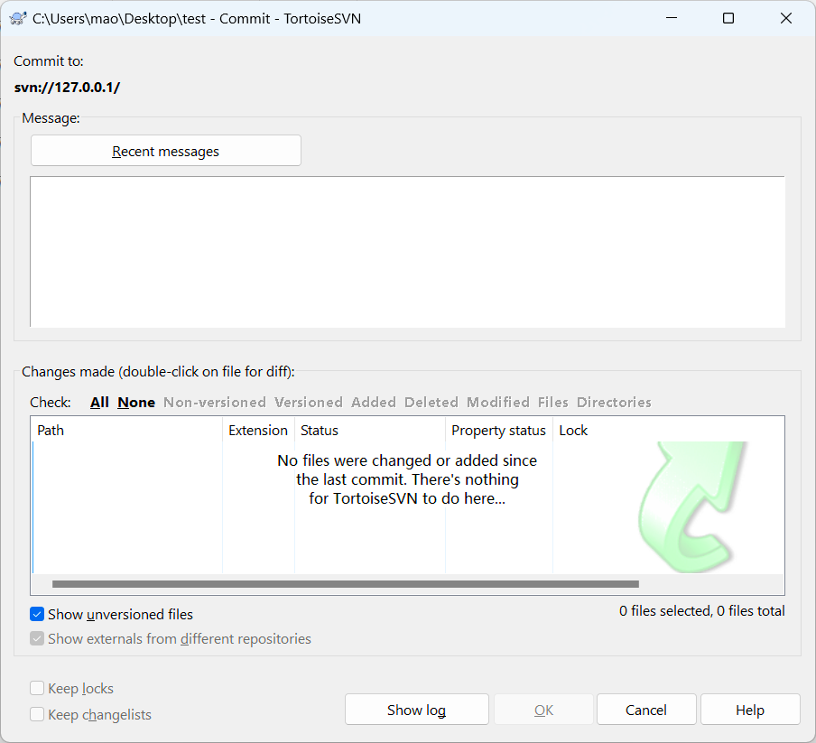


## 忽略某类型文件

添加一个表格文件

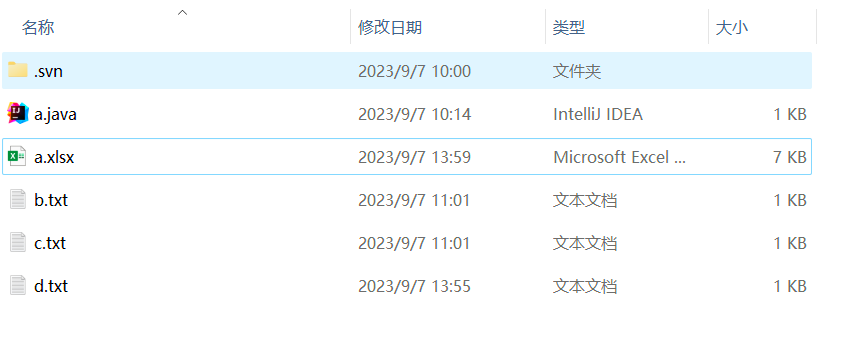

提交时发现文件可以提交


点击取消

右键表格文件

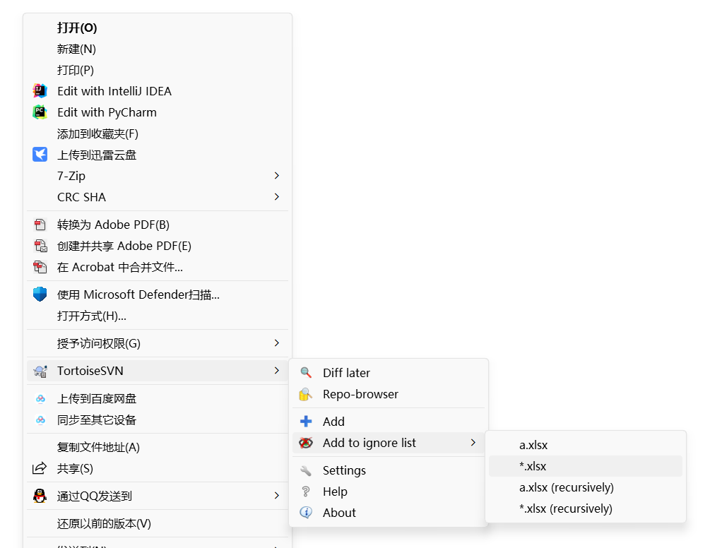


选择*.xlsx

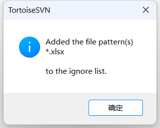


再次提交


提交后再次点击提交


发现文件不存在

新建一个b.xlsx和c.xlsx

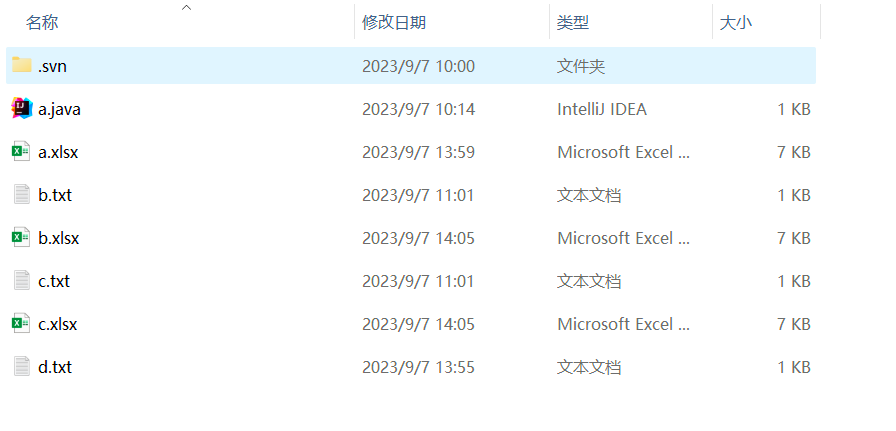


点击提交


文件都不存在

打开test2目录，更新至版本5，新建一个cc.xlsx，点击提交

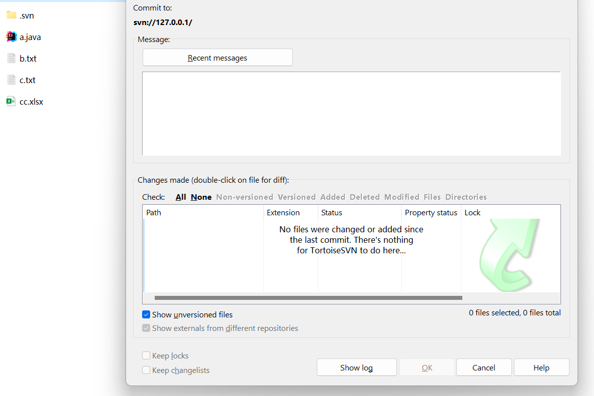


文件不存在


# 版本回退

## 概述

有些时候，软件的运行可能使开发者或使用者不满意，这时我们需要把当前版本退回到以前的某个版本。


## 功能使用

在项目空白处鼠标右键，点击更新至版本


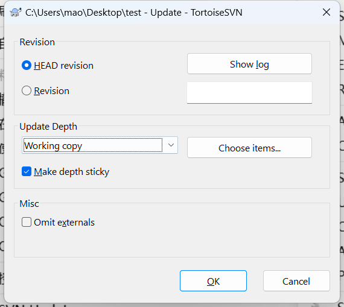


点击确定

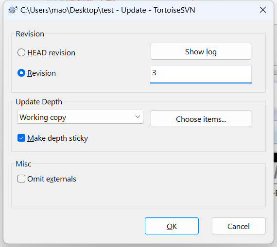


点击确定


# 版本冲突

## 概述

在实际项目开发中，如果两个人同时修改某个文件就会产生版本冲突问题


## 模拟版本冲突

先将test2目录更新到版本5


将test的 b.txt文件更改成如下

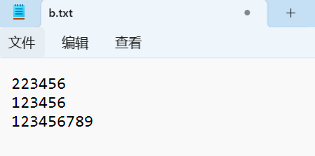


将test2的 b.txt文件更改成如下


test提交文件

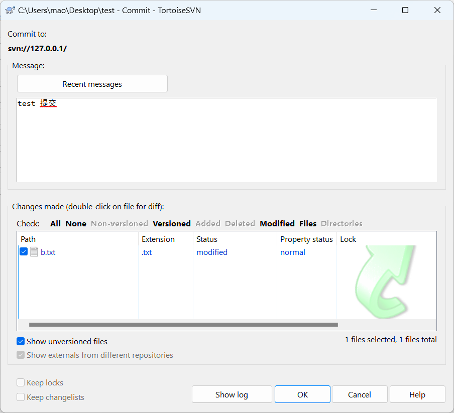


test2先不要更新版本，直接提交

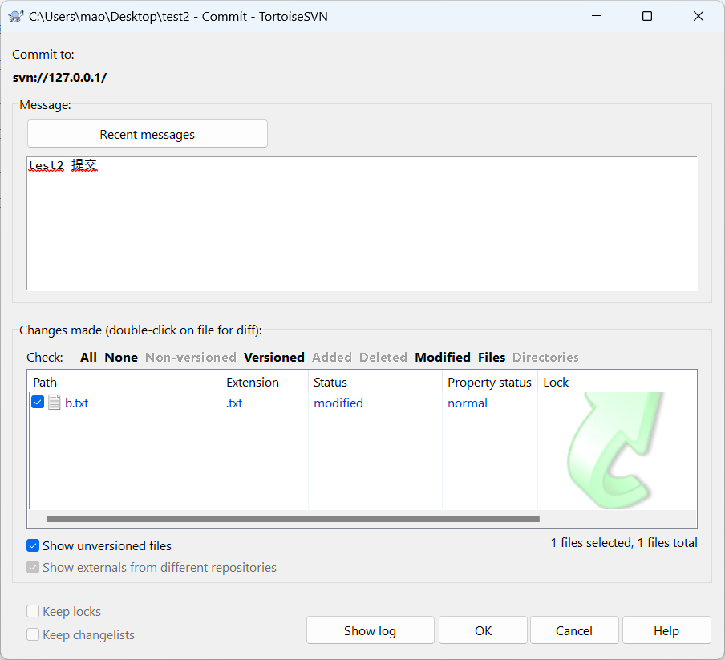


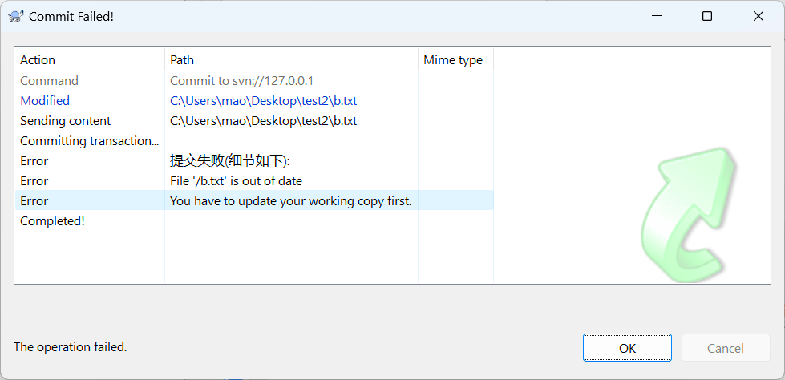


版本冲突


## 解决方案

* 合理分配项目开发模块
* 合理分配项目开发时间
* 通过SVN解决版本冲突问题


提交之前先更新


根据需要更改b.txt文件

```sh
PS C:\Users\mao\Desktop\test2> ls


    目录: C:\Users\mao\Desktop\test2


Mode                 LastWriteTime         Length Name
----                 -------------         ------ ----
-a----          2023/9/7     10:47            130 a.java
-a----          2023/9/7     16:40             50 b.txt
-a----          2023/9/7     16:49             50 b.txt.r5
-a----          2023/9/7     16:49             50 b.txt.r6
-a----          2023/9/7     10:55             12 c.txt
-a----          2023/9/7     14:07           6616 cc.xlsx


PS C:\Users\mao\Desktop\test2> cat .\b.txt.r5
123456
123456
123456789
PS C:\Users\mao\Desktop\test2> cat .\b.txt.r6
223456
123456
123456789
PS C:\Users\mao\Desktop\test2> cat .\b.txt
323456
123456
123456789
PS C:\Users\mao\Desktop\test2>
```


# 多仓库

## 概述

在实际项目开发中，我们可能会同时开发多个项目，那么我们如何进行多项目监管呢？

通过svnserve进行仓库监管，但是监管指令只能监管某一个文件夹，而不能同时监管多个仓库

可以通过监管WebApp总目录来达到监管所有仓库的目的


## 使用

在webApp下运行此命令

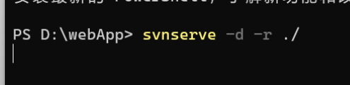


在此目录下再创建一个文件夹，名字为pay


执行：

```sh
svnadmin create ./pay
```


```sh
PS D:\webApp> svnadmin create ./pay
PS D:\webApp> ls


    目录: D:\webApp


Mode                 LastWriteTime         Length Name
----                 -------------         ------ ----
d-----          2023/9/7     17:02                pay
d-----          2023/9/7      9:28                Shop


PS D:\webApp> cd pay
PS D:\webApp\pay> ls


    目录: D:\webApp\pay


Mode                 LastWriteTime         Length Name
----                 -------------         ------ ----
d-----          2023/9/7     17:02                conf
d-----          2023/9/7     17:02                db
d-----          2023/9/7     17:02                hooks
d-----          2023/9/7     17:02                locks
-ar---          2023/9/7     17:02              2 format
-a----          2023/9/7     17:02            251 README.txt


PS D:\webApp\pay>
```


以后使用客户端检出时可以使用 `svn://127.0.0.1/项目名称` 来连接

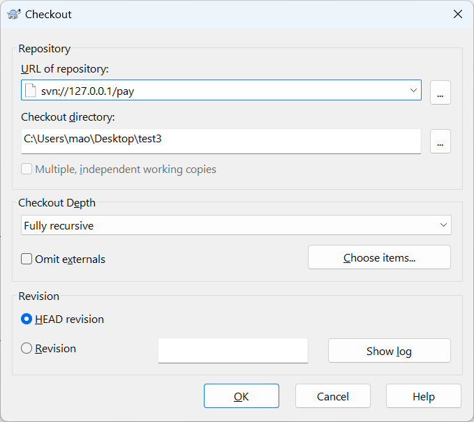


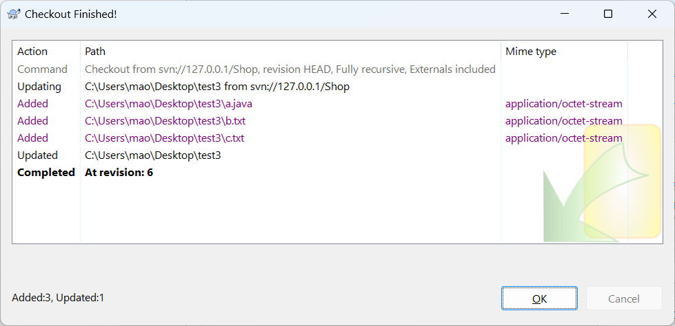


# 权限控制

## 概述

如果要使用权限控制有一个前提：必须首先开启权限功能

在每一个仓库中都有一个conf文件夹，里面有三个文件：

* authz文件：授权文件，告诉哪些用户具有哪些权限
* passwd文件：认证文件，标识当前svn系统中某个仓库具有哪些用户以及相应的密码
* svnserve.conf：服务配置文件


## 开启步骤

### 注释匿名用户的可读写权限

位于svnserve.conf


### 开启认证文件与授权文件


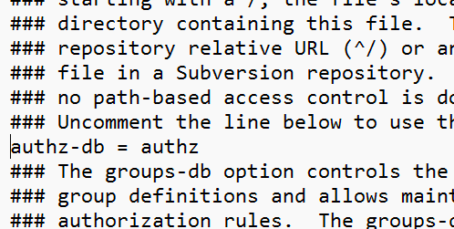


示例：

```properties
### This file controls the configuration of the svnserve daemon, if you
### use it to allow access to this repository.  (If you only allow
### access through http: and/or file: URLs, then this file is
### irrelevant.)

### Visit http://subversion.apache.org/ for more information.

[general]
### The anon-access and auth-access options control access to the
### repository for unauthenticated (a.k.a. anonymous) users and
### authenticated users, respectively.
### Valid values are "write", "read", and "none".
### Setting the value to "none" prohibits both reading and writing;
### "read" allows read-only access, and "write" allows complete 
### read/write access to the repository.
### The sample settings below are the defaults and specify that anonymous
### users have read-only access to the repository, while authenticated
### users have read and write access to the repository.
# anon-access = read
# auth-access = write
### The password-db option controls the location of the password
### database file.  Unless you specify a path starting with a /,
### the file's location is relative to the directory containing
### this configuration file.
### If SASL is enabled (see below), this file will NOT be used.
### Uncomment the line below to use the default password file.
password-db = passwd
### The authz-db option controls the location of the authorization
### rules for path-based access control.  Unless you specify a path
### starting with a /, the file's location is relative to the
### directory containing this file.  The specified path may be a
### repository relative URL (^/) or an absolute file:// URL to a text
### file in a Subversion repository.  If you don't specify an authz-db,
### no path-based access control is done.
### Uncomment the line below to use the default authorization file.
authz-db = authz
### The groups-db option controls the location of the file with the
### group definitions and allows maintaining groups separately from the
### authorization rules.  The groups-db file is of the same format as the
### authz-db file and should contain a single [groups] section with the
### group definitions.  If the option is enabled, the authz-db file cannot
### contain a [groups] section.  Unless you specify a path starting with
### a /, the file's location is relative to the directory containing this
### file.  The specified path may be a repository relative URL (^/) or an
### absolute file:// URL to a text file in a Subversion repository.
### This option is not being used by default.
# groups-db = groups
### This option specifies the authentication realm of the repository.
### If two repositories have the same authentication realm, they should
### have the same password database, and vice versa.  The default realm
### is repository's uuid.
# realm = My First Repository
### The force-username-case option causes svnserve to case-normalize
### usernames before comparing them against the authorization rules in the
### authz-db file configured above.  Valid values are "upper" (to upper-
### case the usernames), "lower" (to lowercase the usernames), and
### "none" (to compare usernames as-is without case conversion, which
### is the default behavior).
# force-username-case = none
### The hooks-env options specifies a path to the hook script environment 
### configuration file. This option overrides the per-repository default
### and can be used to configure the hook script environment for multiple 
### repositories in a single file, if an absolute path is specified.
### Unless you specify an absolute path, the file's location is relative
### to the directory containing this file.
# hooks-env = hooks-env

[sasl]
### This option specifies whether you want to use the Cyrus SASL
### library for authentication. Default is false.
### Enabling this option requires svnserve to have been built with Cyrus
### SASL support; to check, run 'svnserve --version' and look for a line
### reading 'Cyrus SASL authentication is available.'
# use-sasl = true
### These options specify the desired strength of the security layer
### that you want SASL to provide. 0 means no encryption, 1 means
### integrity-checking only, values larger than 1 are correlated
### to the effective key length for encryption (e.g. 128 means 128-bit
### encryption). The values below are the defaults.
# min-encryption = 0
# max-encryption = 256
```


### 编写认证文件定义相关用户名与密码

passwd文件里


```sh
PS D:\webApp\pay\conf> ls


    目录: D:\webApp\pay\conf


Mode                 LastWriteTime         Length Name
----                 -------------         ------ ----
-a----          2023/9/7     17:02           1112 authz
-a----          2023/9/7     17:02            904 hooks-env.tmpl
-a----          2023/9/7     17:31            348 passwd
-a----          2023/9/7     17:27           4452 svnserve.conf


PS D:\webApp\pay\conf> cat .\passwd
### This file is an example password file for svnserve.
### Its format is similar to that of svnserve.conf. As shown in the
### example below it contains one section labelled [users].
### The name and password for each user follow, one account per line.

[users]
# harry = harryssecret
# sally = sallyssecret
admin = 123456
test = 111111
PS D:\webApp\pay\conf>
```


### 编写授权文件

authz文件

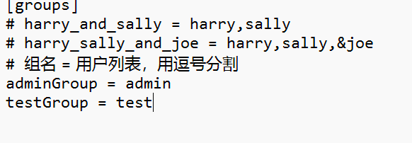


文件示例：

```properties
### This file is an example authorization file for svnserve.
### Its format is identical to that of mod_authz_svn authorization
### files.
### As shown below each section defines authorizations for the path and
### (optional) repository specified by the section name.
### The authorizations follow. An authorization line can refer to:
###  - a single user,
###  - a group of users defined in a special [groups] section,
###  - an alias defined in a special [aliases] section,
###  - all authenticated users, using the '$authenticated' token,
###  - only anonymous users, using the '$anonymous' token,
###  - anyone, using the '*' wildcard.
###
### A match can be inverted by prefixing the rule with '~'. Rules can
### grant read ('r') access, read-write ('rw') access, or no access
### ('').

[aliases]
# joe = /C=XZ/ST=Dessert/L=Snake City/O=Snake Oil, Ltd./OU=Research Institute/CN=Joe Average

[groups]
# harry_and_sally = harry,sally
# harry_sally_and_joe = harry,sally,&joe
# 组名 = 用户列表，用逗号分割
adminGroup = admin
testGroup = test


# [/foo/bar]
# harry = rw
# &joe = r
# * =

# [repository:/baz/fuz]
# @harry_and_sally = rw
# * = r
[Shop:/]
@adminGroup = rw
@testGroup = r

[pay:/]
@adminGroup = rw
@testGroup = rw
```


重启服务器

再次连接pay

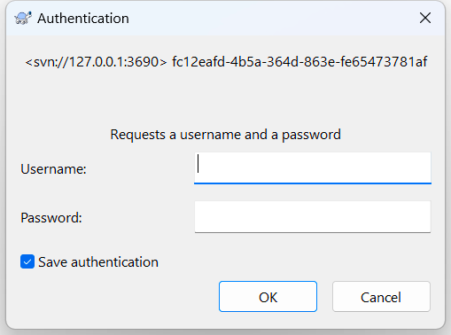


# 配置自启动服务

## 注册服务

命令

```sh
sc create SVNService binpath= "可执行文件的全路径 --service -r webApp仓库" start=auto
```


需要权限，用cmd执行


```sh
sc create SVNService binpath= "D:\Program Files\VisualSVN Server\bin\svnserve.exe --service -r D:/webApp" start=auto
```


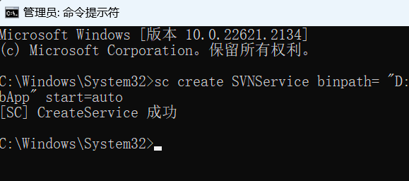


## 查看系统服务

打开任务管理器，选择服务

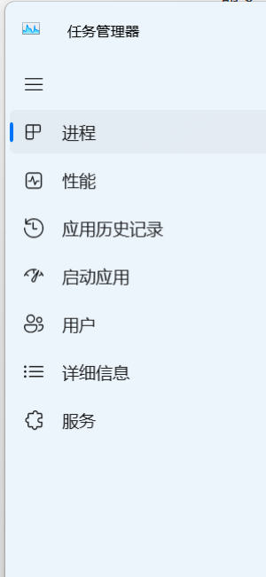


找到SVNService


点击启动


## 启动服务命令

```sh
net start SVNService
```


## 停止服务

```sh
net stop SVNService
```


## 删除服务

```sh
sc delete SVNService
```


```sh
C:\Windows\System32>net stop SVNService
SVNService 服务正在停止.
SVNService 服务已成功停止。


C:\Windows\System32>net start SVNService
SVNService 服务正在启动 .
SVNService 服务已经启动成功。


C:\Windows\System32>sc delete SVNService
[SC] DeleteService 成功

C:\Windows\System32>
```


# 钩子程序

## 概述

所谓钩子就是与一些版本库事件触发的程序，例如新修订版本的创建，或是未版本化属性的修改。

默认情况下，钩子的子目录(版本仓库/hooks/)中包含各种版本库钩子模板

```sh
PS D:\webApp\Shop> ls


    目录: D:\webApp\Shop


Mode                 LastWriteTime         Length Name
----                 -------------         ------ ----
d-----          2023/9/7      9:28                conf
d-----          2023/9/7     16:44                db
d-----          2023/9/7      9:28                hooks
d-----          2023/9/7      9:28                locks
-ar---          2023/9/7      9:28              2 format
-a----          2023/9/7      9:28            251 README.txt


PS D:\webApp\Shop> cd .\hooks\
PS D:\webApp\Shop\hooks> ls


    目录: D:\webApp\Shop\hooks


Mode                 LastWriteTime         Length Name
----                 -------------         ------ ----
-a----          2023/9/7      9:28           2651 post-commit.tmpl
-a----          2023/9/7      9:28           2780 post-lock.tmpl
-a----          2023/9/7      9:28           3008 post-revprop-change.tmpl
-a----          2023/9/7      9:28           2609 post-unlock.tmpl
-a----          2023/9/7      9:28           4051 pre-commit.tmpl
-a----          2023/9/7      9:28           3690 pre-lock.tmpl
-a----          2023/9/7      9:28           3516 pre-revprop-change.tmpl
-a----          2023/9/7      9:28           3370 pre-unlock.tmpl
-a----          2023/9/7      9:28           3763 start-commit.tmpl


PS D:\webApp\Shop\hooks> cat .\post-commit.tmpl
#!/bin/sh

# POST-COMMIT HOOK
#
# The post-commit hook is invoked after a commit.  Subversion runs
# this hook by invoking a program (script, executable, binary, etc.)
# named 'post-commit' (for which this file is a template) with the
# following ordered arguments:
#
#   [1] REPOS-PATH   (the path to this repository)
#   [2] REV          (the number of the revision just committed)
#   [3] TXN-NAME     (the name of the transaction that has become REV)
#
# Because the commit has already completed and cannot be undone,
# the exit code of the hook program is ignored.  The hook program
# can use the 'svnlook' utility to help it examine the
# newly-committed tree.
#
# The default working directory for the invocation is undefined, so
# the program should set one explicitly if it cares.
#
# On a Unix system, the normal procedure is to have 'post-commit'
# invoke other programs to do the real work, though it may do the
# work itself too.
#
# Note that 'post-commit' must be executable by the user(s) who will
# invoke it (typically the user httpd runs as), and that user must
# have filesystem-level permission to access the repository.
#
# On a Windows system, you should name the hook program
# 'post-commit.bat' or 'post-commit.exe',
# but the basic idea is the same.
#
# The hook program runs in an empty environment, unless the server is
# explicitly configured otherwise.  For example, a common problem is for
# the PATH environment variable to not be set to its usual value, so
# that subprograms fail to launch unless invoked via absolute path.
# If you're having unexpected problems with a hook program, the
# culprit may be unusual (or missing) environment variables.
#
# CAUTION:
# For security reasons, you MUST always properly quote arguments when
# you use them, as those arguments could contain whitespace or other
# problematic characters. Additionally, you should delimit the list
# of options with "--" before passing the arguments, so malicious
# clients cannot bootleg unexpected options to the commands your
# script aims to execute.
# For similar reasons, you should also add a trailing @ to URLs which
# are passed to SVN commands accepting URLs with peg revisions.
#
# Here is an example hook script, for a Unix /bin/sh interpreter.
# For more examples and pre-written hooks, see those in
# the Subversion repository at
# http://svn.apache.org/repos/asf/subversion/trunk/tools/hook-scripts/ and
# http://svn.apache.org/repos/asf/subversion/trunk/contrib/hook-scripts/


REPOS="$1"
REV="$2"
TXN_NAME="$3"

mailer.py commit "$REPOS" "$REV" /path/to/mailer.conf
PS D:\webApp\Shop\hooks>
```


钩子程序默认情况可以采用批处理指令或Shell指令来进行编写


## 通过批处理指令编写钩子程序

1. 复制post-commit.tmpl为post-commit.bat文件
2. 填入相关批处理指令


* SET SVN：服务器端SVN路径
* SET DIR：服务器端项目运行目录
* SVN update：通过update指令实时更新数据到DIR目录中


3. 在apache目录创建Shop项目并更新SVN服务端数据到本地
4. 更新文件到SVN服务器端，可以在Shop目录实时获取到最新数据


# SVN扩展程序

## BAE云引擎

### 概述

百度应用引擎（BAE）是百度推出的网络应用开发平台。基于BAE架构，使开发者不需要维护任何服务器，只需要简单的上传应用程序，就可以为用户提供服务

开发者可以基于BAE平台进行PHP、Java、Python、Nodejs应用的开发、编译、发布、调试


### 地址

http://bce.baidu.com/


### 使用BAE云引擎

打开官网


点击产品


点击搜索

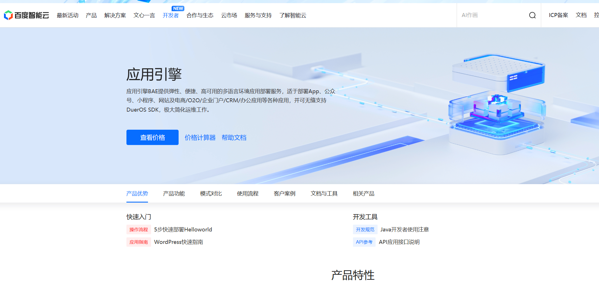


包年包月计费

| CPU规格 （核） | 内存规格（GB） | 硬盘规格（GB） | 包月价格（元/月） | 包年价格（元/年） |
| -------------- | -------------- | -------------- | ----------------- | ----------------- |
| 1              | 1              | 20             | 284               | 3408              |
| 1              | 2              | 20             | 424.76            | 5000              |
| 1              | 4              | 20             | 732.56            | 8328.10           |
| 2              | 2              | 20             | 541.73            | 6158.59           |
| 2              | 4              | 20             | 849.53            | 9657.79           |
| 2              | 8              | 20             | 1465.13           | 16656.19          |
| 2              | 12             | 20             | 2080.73           | 23654.59          |
| 2              | 16             | 20             | 2696.33           | 30652.99          |
| 4              | 4              | 20             | 1083.46           | 12317.18          |
| 4              | 8              | 20             | 1699.06           | 19315.58          |
| 4              | 12             | 20             | 2314.66           | 26313.98          |
| 4              | 16             | 20             | 2930.26           | 33312.38          |
| 4              | 32             | 20             | 5392.66           | 61305.98          |
| 8              | 8              | 20             | 2166.91           | 24634.37          |
| 8              | 12             | 20             | 2782.51           | 31632.77          |
| 8              | 16             | 20             | 3398.11           | 38631.17          |
| 8              | 24             | 20             | 4629.31           | 52627.97          |
| 8              | 32             | 20             | 5860.51           | 66624.77          |
| 8              | 64             | 20             | 10785.31          | 122611.96         |
| 12             | 12             | 20             | 3250.37           | 36951.55          |
| 12             | 16             | 20             | 3865.97           | 43949.95          |
| 12             | 24             | 20             | 5097.17           | 57946.75          |
| 12             | 32             | 20             | 6328.36           | 71943.55          |
| 12             | 48             | 20             | 8790.77           | 99937.15          |
| 12             | 64             | 20             | 11253.17          | 127930.75         |
| 16             | 16             | 20             | 4333.82           | 49268.73          |
| 16             | 24             | 20             | 5565.02           | 63265.54          |
| 16             | 32             | 20             | 6796.22           | 77262.34          |
| 16             | 48             | 20             | 9258.62           | 105255.93         |
| 16             | 64             | 20             | 11721.02          | 133249.53         |


按需计费

| 套餐名称 | CPU  | 内存（GB） | 硬盘（GB） | 公网带宽（Mbps） | 单价（元/分钟） | 小时参考价（元/小时） |
| -------- | ---- | ---------- | ---------- | ---------------- | --------------- | --------------------- |
| 启航I型  | 1核  | 1          | 20         | 1                | 0.0066          | 0.396                 |
| 启航II型 | 1核  | 2          | 20         | 1                | 0.01035         | 0.621                 |
| 进取I型  | 2核  | 4          | 20         | 1                | 0.0207          | 1.242                 |
| 进取II型 | 2核  | 8          | 20         | 1                | 0.0357          | 2.142                 |


点击购买


