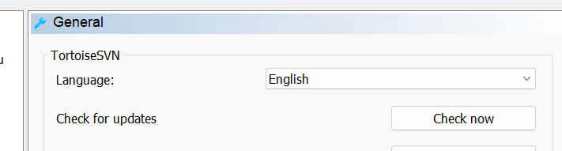
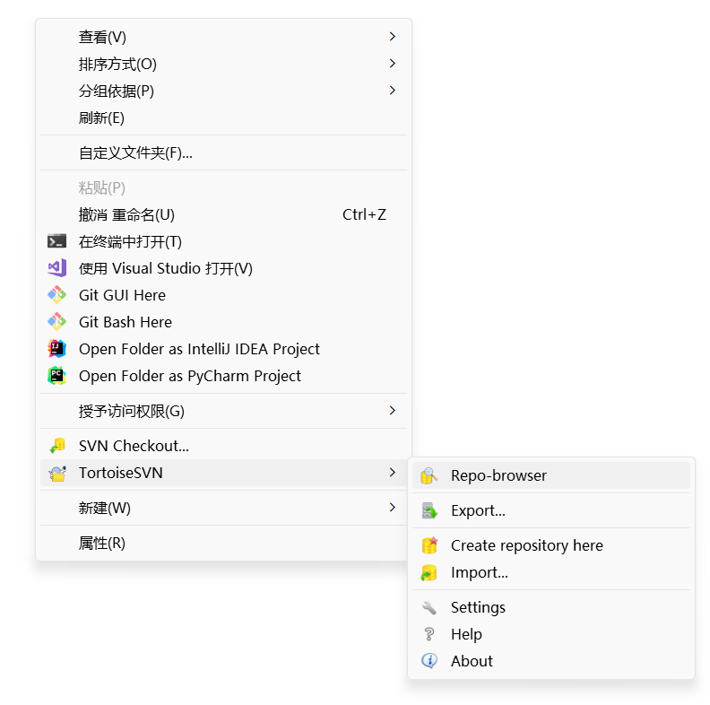
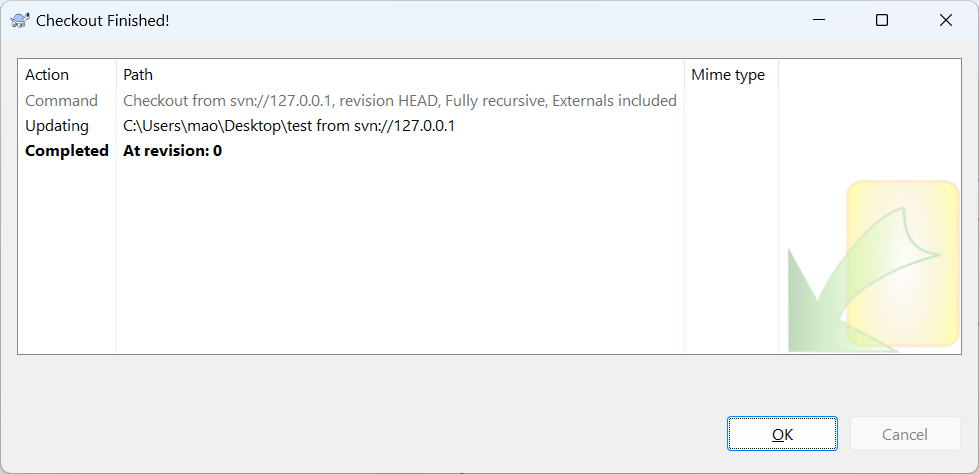

<h1 style="font-size:3.3em;color:skyblue;text-align:center">SVN学习笔记</h1>

[TOC]

---


# 概述

SVN全称SubVersion

SVN是近年来崛起的版本管理工具，是CVS的接班人。目前，绝大多数软件公司都使用SVN作为代码版本管理软件


特点：

* 操作简单，入门容易
* 支持跨平台（Window/Linux/MacOS)
* 支持版本回退功能


# 部署

SVN属于C/S结构软件


服务端软件：VisualSVN

网址：http://www.visualsvn.com/


客户端软件：TortoiseSVN

网址：http://tortoisesvn.net/downloads


https://blog.csdn.net/shangguanruier/article/details/127629878


## 服务端安装

### 第一步：下载


点击下载按钮


点击VisualSVN Server

或者直接[点击下载](https://www.visualsvn.com/files/VisualSVN-Server-5.3.0-x64.msi)


### 第二步：安装


点击接受协议

点击下一步


点击下一步


管理端


## 客户端安装

### 第一步：下载

下载链接：https://zenlayer.dl.sourceforge.net/project/tortoisesvn/1.14.5/Application/TortoiseSVN-1.14.5.29465-x64-svn-1.14.2.msi


### 第二步：安装


选择安装路径


安装完成


### 第三步：安装汉化包

下载安装语言包


桌面右键，选择设置





## 使用客户端软件连接SVN服务器

首先在你的项目目录鼠标右键TortoiseSVN版本库浏览器à输出SVN服务器地址


# 入门

## 配置服务端

首先在SVN服务器端创建一个公有目录WebApp做为项目目录

在WebApp目录下创建Shop文件夹，做为版本仓库

```sh
PS D:\webApp> ls


    目录: D:\webApp


Mode                 LastWriteTime         Length Name
----                 -------------         ------ ----
d-----          2023/9/7      9:25                Shop


PS D:\webApp> cd .\Shop\
PS D:\webApp\Shop> ls
PS D:\webApp\Shop>
```


创建版本仓库：

```sh
svnadmin create Shop仓库文件夹路径
```

```sh
PS D:\webApp\Shop> svnadmin create ./
PS D:\webApp\Shop> ls


    目录: D:\webApp\Shop


Mode                 LastWriteTime         Length Name
----                 -------------         ------ ----
d-----          2023/9/7      9:28                conf
d-----          2023/9/7      9:28                db
d-----          2023/9/7      9:28                hooks
d-----          2023/9/7      9:28                locks
-ar---          2023/9/7      9:28              2 format
-a----          2023/9/7      9:28            251 README.txt


PS D:\webApp\Shop> tree /f
文件夹 PATH 列表
卷序列号为 5E84-66B0
D:.
│  format
│  README.txt
│
├─conf
│      authz
│      hooks-env.tmpl
│      passwd
│      svnserve.conf
│
├─db
│  │  current
│  │  format
│  │  fs-type
│  │  fsfs.conf
│  │  min-unpacked-rev
│  │  txn-current
│  │  txn-current-lock
│  │  uuid
│  │  write-lock
│  │
│  ├─revprops
│  │  └─0
│  │          0
│  │
│  ├─revs
│  │  └─0
│  │          0
│  │
│  ├─transactions
│  └─txn-protorevs
├─hooks
│      post-commit.tmpl
│      post-lock.tmpl
│      post-revprop-change.tmpl
│      post-unlock.tmpl
│      pre-commit.tmpl
│      pre-lock.tmpl
│      pre-revprop-change.tmpl
│      pre-unlock.tmpl
│      start-commit.tmpl
│
└─locks
        db-logs.lock
        db.lock

PS D:\webApp\Shop>
```


## 服务端监管

命令：

```sh
svnserve -d  -r 版本仓库目录
```


参数：

* -d：后台运行
* -r：监管目录，版本仓库目录


光标停留在下一行就证明操作成功，此时不要关闭窗口


## 权限控制

默认情况下，SVN服务器是不允许匿名用户上传文件到服务器端的，所以必须更改系统相关配置文件

配置文件位于conf目录下的svnserve.conf文件里

文件内容如下：

```properties
### This file controls the configuration of the svnserve daemon, if you
### use it to allow access to this repository.  (If you only allow
### access through http: and/or file: URLs, then this file is
### irrelevant.)

### Visit http://subversion.apache.org/ for more information.

[general]
### The anon-access and auth-access options control access to the
### repository for unauthenticated (a.k.a. anonymous) users and
### authenticated users, respectively.
### Valid values are "write", "read", and "none".
### Setting the value to "none" prohibits both reading and writing;
### "read" allows read-only access, and "write" allows complete 
### read/write access to the repository.
### The sample settings below are the defaults and specify that anonymous
### users have read-only access to the repository, while authenticated
### users have read and write access to the repository.
# anon-access = read
# auth-access = write
### The password-db option controls the location of the password
### database file.  Unless you specify a path starting with a /,
### the file's location is relative to the directory containing
### this configuration file.
### If SASL is enabled (see below), this file will NOT be used.
### Uncomment the line below to use the default password file.
# password-db = passwd
### The authz-db option controls the location of the authorization
### rules for path-based access control.  Unless you specify a path
### starting with a /, the file's location is relative to the
### directory containing this file.  The specified path may be a
### repository relative URL (^/) or an absolute file:// URL to a text
### file in a Subversion repository.  If you don't specify an authz-db,
### no path-based access control is done.
### Uncomment the line below to use the default authorization file.
# authz-db = authz
### The groups-db option controls the location of the file with the
### group definitions and allows maintaining groups separately from the
### authorization rules.  The groups-db file is of the same format as the
### authz-db file and should contain a single [groups] section with the
### group definitions.  If the option is enabled, the authz-db file cannot
### contain a [groups] section.  Unless you specify a path starting with
### a /, the file's location is relative to the directory containing this
### file.  The specified path may be a repository relative URL (^/) or an
### absolute file:// URL to a text file in a Subversion repository.
### This option is not being used by default.
# groups-db = groups
### This option specifies the authentication realm of the repository.
### If two repositories have the same authentication realm, they should
### have the same password database, and vice versa.  The default realm
### is repository's uuid.
# realm = My First Repository
### The force-username-case option causes svnserve to case-normalize
### usernames before comparing them against the authorization rules in the
### authz-db file configured above.  Valid values are "upper" (to upper-
### case the usernames), "lower" (to lowercase the usernames), and
### "none" (to compare usernames as-is without case conversion, which
### is the default behavior).
# force-username-case = none
### The hooks-env options specifies a path to the hook script environment 
### configuration file. This option overrides the per-repository default
### and can be used to configure the hook script environment for multiple 
### repositories in a single file, if an absolute path is specified.
### Unless you specify an absolute path, the file's location is relative
### to the directory containing this file.
# hooks-env = hooks-env

[sasl]
### This option specifies whether you want to use the Cyrus SASL
### library for authentication. Default is false.
### Enabling this option requires svnserve to have been built with Cyrus
### SASL support; to check, run 'svnserve --version' and look for a line
### reading 'Cyrus SASL authentication is available.'
# use-sasl = true
### These options specify the desired strength of the security layer
### that you want SASL to provide. 0 means no encryption, 1 means
### integrity-checking only, values larger than 1 are correlated
### to the effective key length for encryption (e.g. 128 means 128-bit
### encryption). The values below are the defaults.
# min-encryption = 0
# max-encryption = 256
```


修改第19行的`anon-access = read`，取消注释，更改成`anon-access = write`


## 客户端连接SVN服务器

先Checkout检出，相当于git的克隆

创建一个自己的项目目录，进入此目录，在项目目录点击鼠标右键，选择版本库浏览器




输入SVN服务器地址


右键点击检出





如果出现.svn文件夹，则检出成功


```sh
PS C:\Users\mao\Desktop\test\.svn> ls


    目录: C:\Users\mao\Desktop\test\.svn


Mode                 LastWriteTime         Length Name
----                 -------------         ------ ----
d-----          2023/9/7     10:00                pristine
d-----          2023/9/7     10:00                tmp
-a----          2023/9/7     10:00              3 entries
-a----          2023/9/7     10:00              3 format
-a----          2023/9/7     10:00         122880 wc.db
-a----          2023/9/7     10:00              0 wc.db-journal


PS C:\Users\mao\Desktop\test\.svn>
```


# SVN三大指令

## Checkout

检出操作，相当于git的`git clone`

Checkout只在第一次链接时操作一次，以后如果进行更新操作可以使用Update

步骤：

1. 链接到SVN服务器端
2. 更新服务端数据到本地


## Commit

