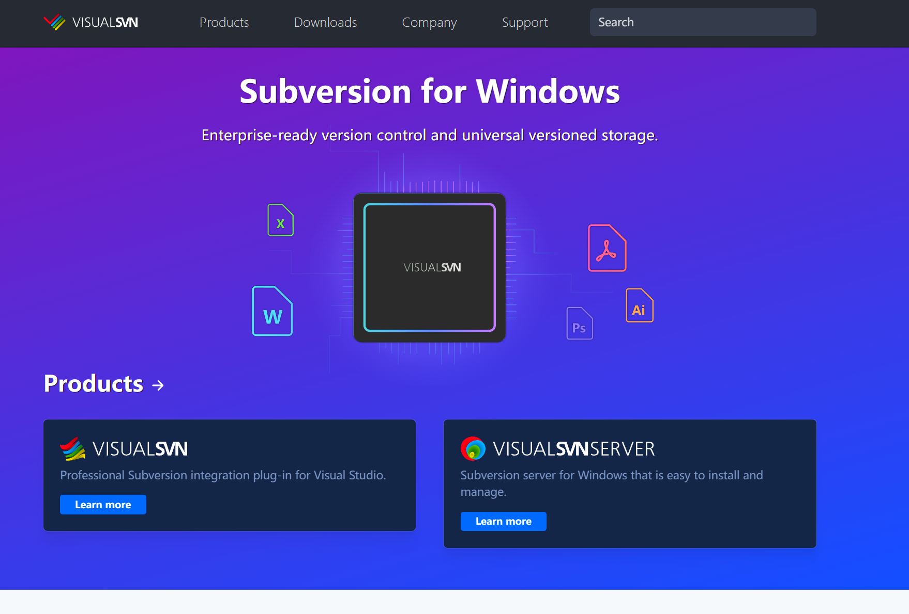
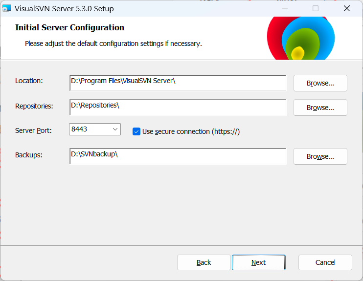
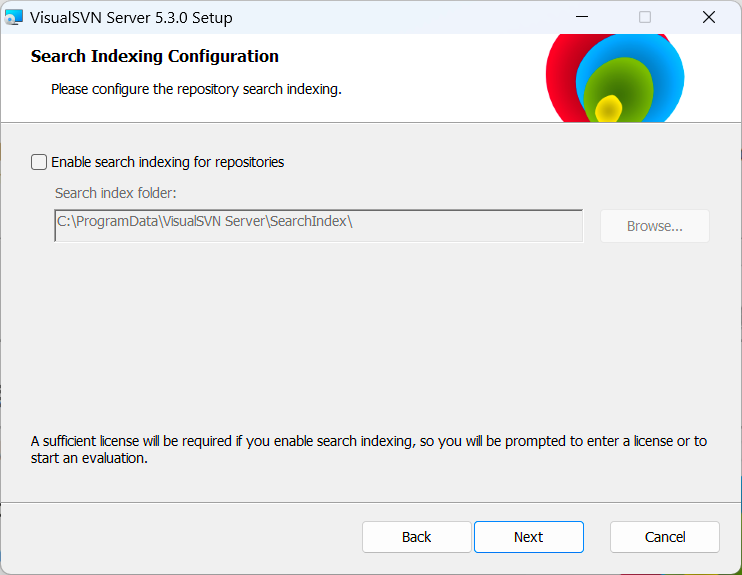
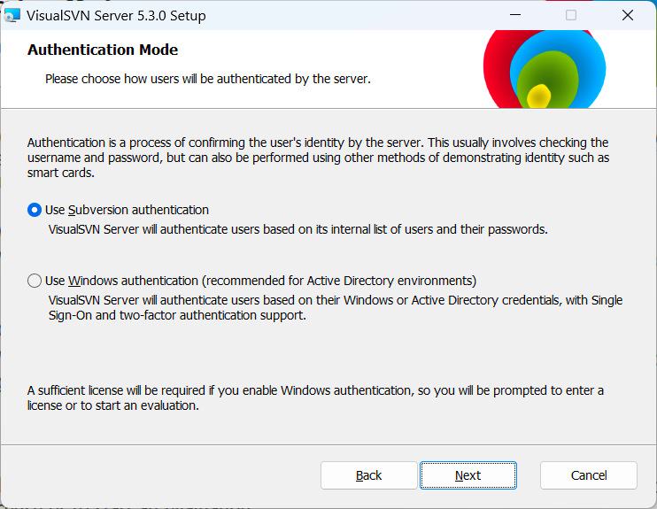
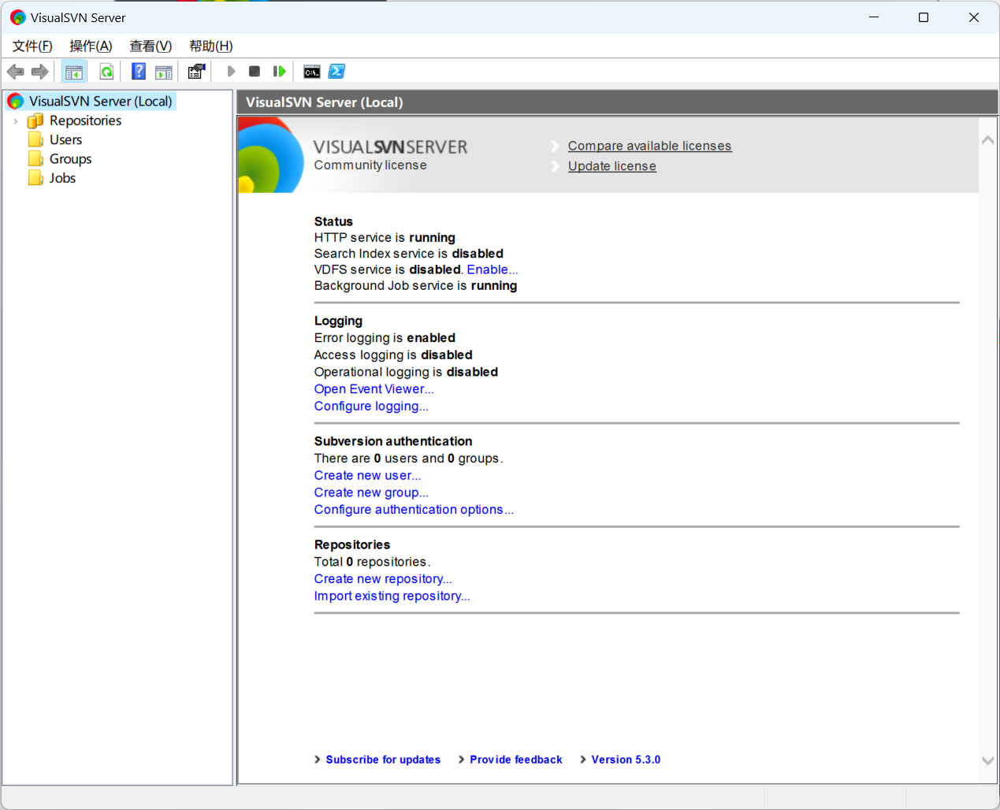
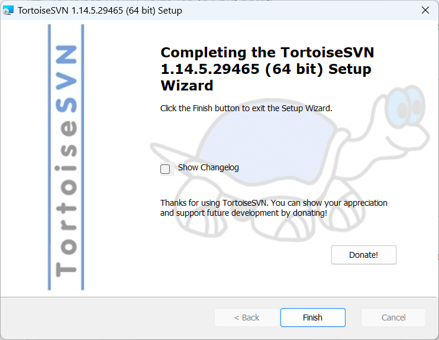

<h1 style="font-size:3.3em;color:skyblue;text-align:center">SVN学习笔记</h1>

[TOC]

---

# 概述

SVN全称SubVersion

SVN是近年来崛起的版本管理工具，是CVS的接班人。目前，绝大多数软件公司都使用SVN作为代码版本管理软件

特点：

* 操作简单，入门容易
* 支持跨平台（Window/Linux/MacOS)
* 支持版本回退功能

# 部署

SVN属于C/S结构软件

服务端软件：VisualSVN

网址：http://www.visualsvn.com/

客户端软件：TortoiseSVN

网址：http://tortoisesvn.net/downloads

https://blog.csdn.net/shangguanruier/article/details/127629878

## 服务端安装

### 第一步：下载

点击下载按钮

点击VisualSVN Server

或者直接[点击下载](https://www.visualsvn.com/files/VisualSVN-Server-5.3.0-x64.msi)

### 第二步：安装

点击接受协议

点击下一步

点击下一步

管理端

## 客户端安装

### 第一步：下载

下载链接：https://zenlayer.dl.sourceforge.net/project/tortoisesvn/1.14.5/Application/TortoiseSVN-1.14.5.29465-x64-svn-1.14.2.msi

### 第二步：安装

选择安装路径

安装完成

### 第三步：安装汉化包

下载安装语言包

桌面右键，选择设置

## 使用客户端软件连接SVN服务器

首先在你的项目目录鼠标右键TortoiseSVN版本库浏览器à输出SVN服务器地址

# 入门

